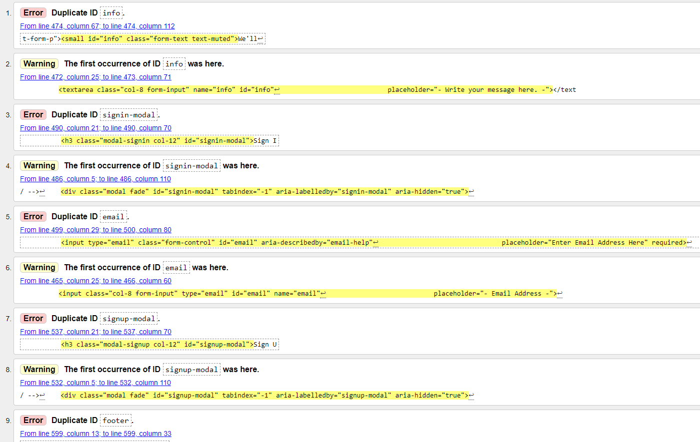
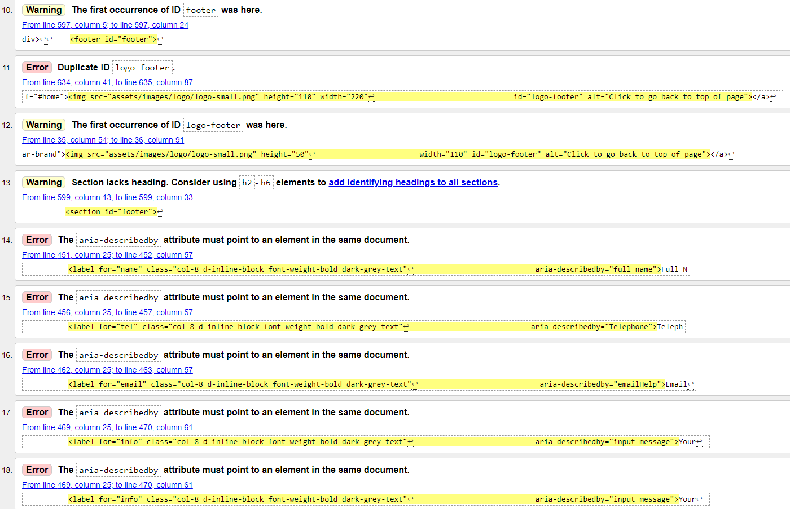
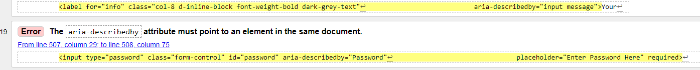

### Navigation bar
>
> * When at mobile size, the hamburger menu shows at the right side. When clicked, the link-items are shown at the left side. This isn't an intuitive UX, since you would expect the listed items to show at the right side as well.
>
>
>
>
>
>
>
>
---

> The W3C Markup Validator and W3C CSS Validator Services were used to validate every page of the project to ensure there were no syntax errors in the project.
>
> * [W3C HTML Validator](https://validator.w3.org/) - Used to validate HTML
>
> The first results where as follows :
>
> 
> 
> 
> 
>
> * [W3C CSS Validator](https://jigsaw.w3.org/css-validator/) - Used to validate CSS
>
>
>  -   #### **Further testing**
>
>      Google Lighthouse
>
>  -   #### **Known Bugs**
>
>
>
>
>
>
>
>
> [Return to README.md Document](https://github.com/nowane/Milestone1/blob/master/README.md)